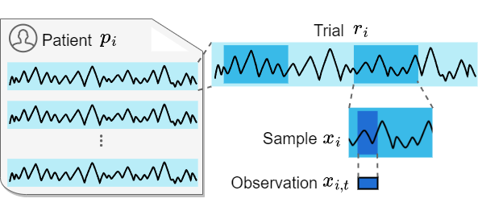

  
# Contrast Everything: Multi-Granularity Representation Learning for Medical Time-Series (COMET)  
  
## Overview  
This repository contains description of three datasets and the code of developed COMET model for manuscript *Contrast Everything: A Hierarchical Contrastive Framework for Medical Time-Series (Neurips 2023)*. We propose COMET, an innovative hierarchical framework that leverages data consistencies at all inherent levels in medical time series. We conduct experiments in the challenging patient-independent setting. We compare COMET against six baselines using three diverse datasets, which include ECG signals for myocardial infarction and EEG signals for Alzheimer's and Parkinson's diseases. The following figure illustrates the structure of medical time series. Medical time series commonly have four levels (coarse to fine): patient, trial, sample, and observation. An observation is a single value in univariate time series and a vector in multivariate time series.



 
## Key idea of COMET
Capturing data consistency is crucial in the development of a contrastive learning framework. Data consistency refers to the shared commonalities preserved within the data, which provide a supervisory signal to guide model optimization. Utilizing this consistency as prior knowledge can reduce the reliance on labeled data for downstream tasks. Contrastive learning captures data consistency by contrasting positive and negative data pairs, where positive pairs share commonalities and negative pairs do not. We propose data consistency across four levels of granularity, spanning from fine-grained to coarse-grained. These levels encompass observation, sample, trial, and patient-level granularities. Although we present four levels here, our model can easily be adapted to accommodate specific datasets by adding or removing granularity levels. 
)  
**Overview of COMET approach.**  Our COMET model consists of four contrastive blocks, each illustrating the formulation of positive pairs and negative pairs at different granularities. In the observation-level contrastive, an observation and its augmented view serve as a positive pair. Similarly, in the sample-level contrastive, a sample and its augmented view form a positive pair. Moving to the trial-level contrastive, two samples from the same trial are considered to be a positive pair. The patient-level contrastive follows a similar pattern, where two samples from the same patient are regarded as a positive pair. Positive pairs and corresponding negative pairs will be utilized to build contrastive loss in embedding space after being processed by encoder $G$.


  
  
## Datasets  
### Data preprocessing
(1) **[AD](https://osf.io/jbysn/)** contains EEG recordings from 12 patients with Alzheimer's disease and 11 healthy controls. Each patient has an average of 30.0 $\pm$ 12.5 trials. Each trial corresponds to a 5-second interval with 1280 timestamps (sampled at 256Hz) and includes 16 channels. Prior to further processing, each trial is scaled using a standard scaler. To facilitate analysis, we segment each trial into 9 half-overlapping samples, where each sample has a duration of 256 timestamps (equivalent to 1 second). Additionally, we assign a unique trial ID and patient ID to each sample based on its origin in terms of the patient and trial.

(2) **[PTB dataset](https://physionet.org/content/ptbdb/1.0.0/)** contains ECG recordings from 290 patients, with 15 channels sampled at 1000 Hz. There are a total of 8 types of heart diseases present in the dataset. For this paper, we focus on binary classification using a subset of the dataset that includes 198 patients with major disease labels, specifically Myocardial infarction and healthy controls. To preprocess the ECG signals, they are first normalized using a standard scaler after being resampled to a frequency of 250 Hz. Due to special peak information in ECG signals, a regular sliding window segmentation approach may result in the loss of crucial information. To address this issue, a different segmentation strategy is employed. Instead of sliding windows, the raw trials are segmented into individual heartbeats, with each heartbeat treated as a sample. To perform this segmentation, (1) the first step involves determining the maximum duration. The median value of R-Peak intervals across all channels is calculated for each raw trial, and outliers are removed to obtain a reasonable maximum interval as the standard heartbeat duration. (2) The next step is to determine the position of the first R-Peak. The median value of the first R-Peak position is calculated and used for all channels. (3) Next, the raw trials are split into individual heartbeat segments based on the median value of their respective R-Peak intervals. Each heartbeat is sampled starting from the R-Peak position, with the segments extending to both ends with half the length of the median interval. (4) To ensure the same length of the heartbeat samples, zero padding is applied to align their lengths with the maximum duration. (5) Finally, the samples are merged into trials, where 10 nearby samples are grouped together to form a trial.

(3) **[TDBrain dataset](https://brainclinics.com/resources/)** contains EEG recordings of 1274 patients with 33 channels (500 Hz) during EC (Eye closed) and EO (Eye open) tasks. The dataset consists of 60 types of diseases, and it is possible for a patient to have multiple diseases simultaneously. This paper focuses on a subset of the dataset, specifically 25 patients with Parkinson's disease and 25 healthy controls. Only the EC task trials are used for representation learning. To process the raw EC trials, we employ a sliding window approach that continuously moves from the middle of the trial to both ends without any overlap. Each raw EC trial is divided into processed trials with a length of 2560 timestamps (10 seconds) after resampling to 256 Hz. These processed trials are then scaled using a standard scaler. Furthermore, each trial is split into 19 half-overlapping samples, with each sample having a length of 256 timestamps (1 second). In addition to the binary label indicating Parkinson's disease or healthy, each sample is assigned a patient and trial ID based on the patient and processed trial it originates from. It is important to note that the trial ID refers to the ID of the processed trial and not the raw EC trial.


### Processed data 
To get processed dataset, run notebooks in folder `data_processing/` for each raw dataset. The folder for processed datasets have two directories: `Feature/` and `Label/`. The folder `Feature/` contains file named in format `feature_ID.npy` files for all the patients. Each`feature_ID.npy` file contains trials belongs to the same patient and stacked into a 3-D array with shape [N, T, D], where N denotes # of trials, T denotes the timestamps for a trial, and C denotes the feature dimensions.   
The folder `Label/` has a file with name `label.npy`. This label file is a 2-D array with shape [N, 2], where N also denotes the # of patients. The first column is the label, and the second column is the patient ID, ranging from 1 to N. The processed data should be put into `datasets/DATA_NAME/` so that each patient file can be located by `datasets/DATA_NAME/Feature/feature_ID.npy`, and the label file can be located by `datasets/DATA_NAME/Label/label.npy`.  
  

## Experimental setups

We evaluate our model in three different settings: partial fine-tuning, full fine-tuning, and semi-supervised learning via fine-tuning, and in comparison with 5 state-of-the-art methods: [TS2vec](https://github.com/yuezhihan/ts2vec), [Mixing-up](https://github.com/Wickstrom/MixupContrastiveLearning), [TS-TCC](https://github.com/emadeldeen24/TS-TCC), [SimCLR](https://github.com/iantangc/ContrastiveLearningHAR), and [TF-C](https://github.com/mims-harvard/TFC-pretraining). We add two additional baselines trained without any pre-training: Non-DL a non-deep learning logistic regression model) and Random Init. (randomly initializes the fine-tuning model). 

**Setting 1: Partial fine-tuning.** We add a logistic regression classifier $L$ on top of the pre-trained encoder $G$. The training process utilizes 100% labeled training data for sample classification. Notably, the parameters of the encoder $G$ are frozen during training, ensuring that only the classifier $L$ is fine-tuned.

**Setting 2: Full fine-tuning.** We add a two-layer fully connected network classifier $P$ to the pre-trained encoder $G$. The training process utilizes 100% of the labeled training data for sample classification. Unlike the Partial fine-tuning setting, both the encoder $G$ and classifier $P$ are trainable, allowing for fine-tuning of the entire network structure. 

**Setting 2: Semi-supervised learning via fine-tuning.** We a two-layer fully connected network classifier $P$ is added to the pre-trained encoder $G$, both of which are trainable (same as in full fine-tuning setting). However, here only a fraction of labeled training data is used for fine-tuning. We employ label fractions of 1\%  and 10\% for fine-tuning the model.


## Requirements  
  
The recommended requirements are specified as follows:  
* Python 3.10  
* Jupyter Notebook  
* scikit-learn==1.2.1    
* torch==1.13.1+cu116    
* matplotlib==3.7.1    
* numpy==1.23.5    
* scipy==1.10.1    
* pandas==1.5.3    
* wfdb==4.1.0    
* neurokit2==0.2.4  
  
The dependencies can be installed by:  
```bash  
pip install -r requirements.txt
```
  
## Running the code  
  
We provide jupyter notebook example for each dataset. To train and evaluate COMET on a dataset, simply run `DatasetName_example.ipynb`, such as `AD_example.ipynb`.  All the setups including pre-training, partial fine-tuning, full fine-tuning, and semi fine-tuning are running step by step with command in the notebook.  

After training and evaluation, the pre-training model and fine-tuning model can be found in`test_run/DatasetName/`; and the logging file for validation and test results can be found in  `logging/DatasetName/`. You could also modify the working and logging directory in jupyter notebook.  
